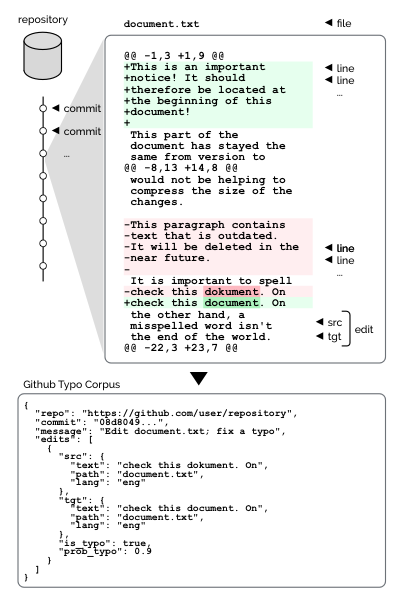

# GitHub Typo Corpus

A Large-Scale Multilingual Dataset of Misspellings and Grammatical Errors

[Masato Hagiwara](http://masatohagiwara.net/) and [Masato Mita](https://sites.google.com/view/masatomita/)

## Introduction

 

Are you the kind of person who makes a lot of typos when writing code? Or are you the one who fixes them by making "fix typo" commits? Either way, thank you—you contributed to the state-of-the-art in the  NLP field.
 
GitHub Typo Corpus is a large-scale dataset of misspellings and grammatical errors along with their corrections harvested from GitHub. It contains more than 350k edits and 65M characters in more than 15 languages, making it the largest dataset of misspellings to date. 

See [the paper](https://arxiv.org/abs/1911.12893) for more information.

## Dataset

[Download the GitHub Typo Corpus (ver. 1.0.0)](https://github-typo-corpus.s3.amazonaws.com/data/github-typo-corpus.v1.0.0.jsonl.gz)


The dataset is formatted in JSONL, one commit object per line. Here's sample of a commit object in the dataset:

```
{
  "repo": "https://github.com/user/repository",
  "commit": "08d8049...",
  "message": "Edit document.txt; fix a typo",
  "edits": [
    {
      "src": {
        "text": "check this dokument. On",
        "path": "document.txt",
        "lang": "eng",
        "ppl": 14.75...
      },
      "tgt": {
        "text": "check this document. On",
        "path": "document.txt",
        "lang": "eng",
        "ppl": 13.03...
      },
      "prob_typo": 0.9,
      "is_typo": true
    }
  ]
}
```

The commit object contains the following keys:

* `repo`: URL of the repository
* `commit`: hash of the commit
* `message`: commit message
* `edits`: list of edits extracted from this commit. An edit object contains the following keys:
    * `src`: text info before the edit
    * `tgt`: text info after the edit
    * `prob_typo`: probability that this edit is a typo edit (versus a type of edit that changes the meaning before and after the edit)
    * `is_typo`: true/false indicating if this edit is a typo edit (i.e., if `prob_typo` > 0.5)
    * `src` and `tgt` contain the following keys:
        * `text`: text of edit
        * `path`: path of the file the edit is made
        * `lang`: language of the text (automatically detected by [NanigoNet](https://github.com/mhagiwara/nanigonet))
        * `ppl`: perplexity of the text measured by a language model
    * Note: The `prob_typo`, `is_typo`, and `ppl` keys are only available for English (`eng`), Simplified Chinese (`cmn-hans`), and Japanese (`jpn`), the three largest languages in the dataset.

We recommend using tools like [jq](https://stedolan.github.io/jq/) when browsing the file.

## Source

See [src/](src/) for the source code for collecting repositories, commits, and edits. You need Python3 + [GitPython](https://gitpython.readthedocs.io/en/stable/) to run the code.

## Terms

The copyright and license terms of the individual commits and texts contained in the dataset follow the terms of the repositories they belong to. We collect and publish the GitHub Typo Corpus under [GitHub's Acceptable Use Policies—5. Scraping and API Usage Restrictions](https://help.github.com/en/github/site-policy/github-acceptable-use-policies#5-scraping-and-api-usage-restrictions). Let us know if you find any copyright issues regarding the dataset.
